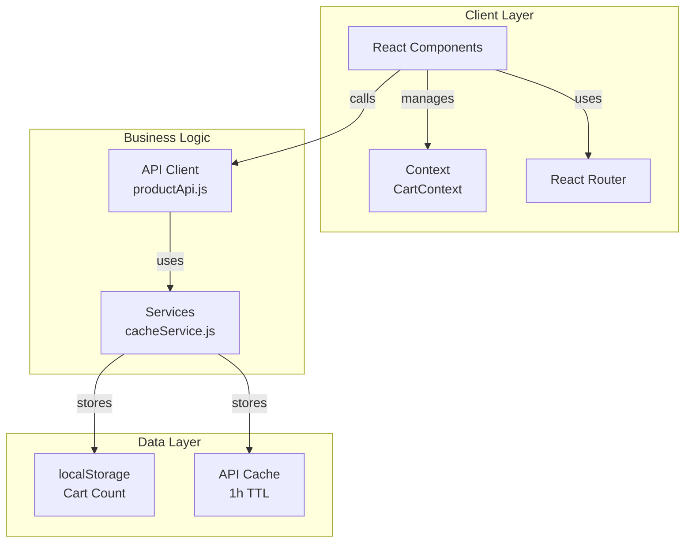
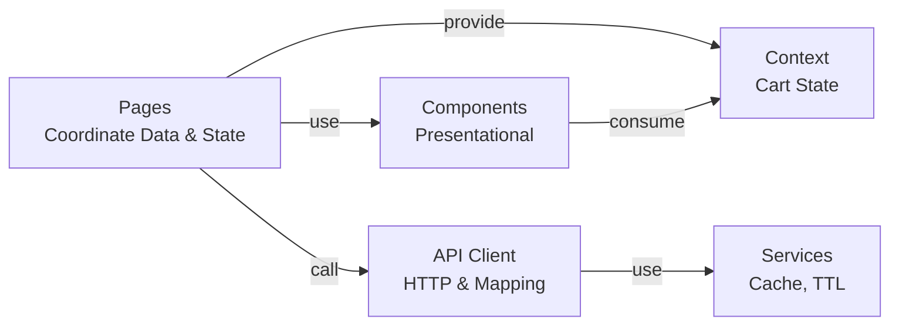
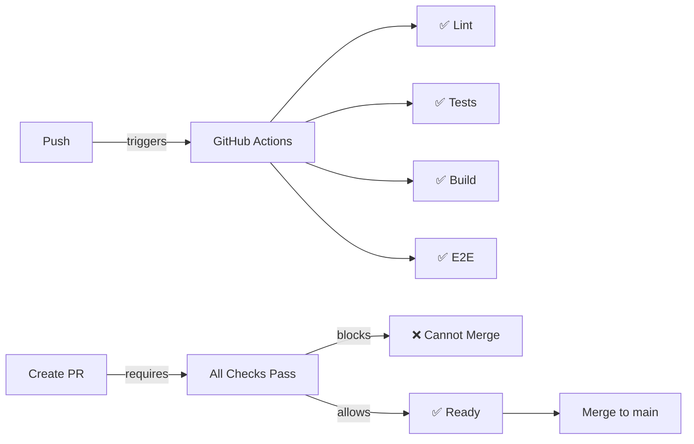

# Mobile Device Store - Frontend SPA

React single-page application for browsing and purchasing mobile devices. Built with Vite, React Router, and Vitest.

**Demo**: [Live Application](https://itx-frontend-test.onrender.com/)  
**Repository**: [GitHub](https://github.com/Lolo179/challenge-luis)

## Features

- 📱 **Product Listing** - Browse all available mobile devices with real-time search by brand and model
- 🔍 **Search & Filter** - Instantly filter products by brand and model name
- 📋 **Product Details** - View comprehensive specifications (CPU, RAM, storage, battery, cameras, dimensions)
- 🛒 **Shopping Cart** - Add products with color and storage selection
- 🔗 **Client-side Routing** - Navigate between pages without page reload (React Router)
- ⚡ **Response Caching** - 1-hour TTL cache for API responses to reduce network calls
- 💾 **Cart Persistence** - Shopping cart count saved to localStorage

## Technology Stack

| Layer | Technology | Version |
|-------|-----------|---------|
| **UI Framework** | React | 19.2.7 |
| **Build Tool** | Vite | 8.1.1 |
| **Routing** | React Router | 7.18.1 |
| **Unit Testing** | Vitest | 4.1.10 |
| **Component Testing** | React Testing Library | 16.3.2 |
| **E2E Testing** | Playwright | Latest |
| **Linting** | ESLint | 10.6.0 |
| **Language** | JavaScript ES6+ | - |

## Architecture



### Project Structure

```
src/
├── api/
│   └── productApi.js              # HTTP client with response mapping
├── components/
│   ├── Header.jsx                 # Navigation + cart counter
│   ├── ProductCard.jsx            # Product list item
│   ├── ProductDescription.jsx     # Product specs display
│   └── ProductActions.jsx         # Storage/color + add to cart
├── context/
│   └── CartContext.jsx            # Global cart state
├── pages/
│   ├── ProductListPage.jsx        # Main page with search
│   └── ProductDetailPage.jsx      # Single product page
├── services/
│   └── cacheService.js            # localStorage wrapper with TTL
├── __fixtures__/
│   └── products.js                # Reusable test data
└── setupTest.js                   # Global test configuration

Tests are co-located: ProductCard.test.jsx, ProductListPage.test.jsx, etc.
```

### Data Flow



## Getting Started

### Prerequisites

- **Node.js** 24+ 
- **npm** 10+
- **Git**

### Installation

```bash
# Clone
git clone git@github.com:Lolo179/challenge-luis.git
cd inditex-frontend

# Install & run
npm install
npm run dev
```

Server runs at `http://localhost:5173`

### Available Scripts

```bash
npm run dev              # Start dev server
npm run build            # Production build
npm run test             # Unit tests (watch mode)
npm run test -- --run    # Unit tests (once)
npm run e2e              # E2E tests with Playwright
npm run lint             # ESLint check
```

## Testing

### Unit Tests (24 tests)

```bash
npm run test -- --run
```

**Coverage:**
- ✅ API client, caching, response mapping
- ✅ Component rendering, interactions
- ✅ Page data loading, filtering
- ✅ Service TTL, persistence

### End-to-End Tests (12 tests)

```bash
npm run e2e
```

**Coverage:** Product list, search, cart, navigation (Chrome + Firefox)

### Test Summary

- **Unit**: 24/24 ✅
- **E2E**: 12/12 ✅
- **Build**: ✅ (~77KB gzipped)
- **Lint**: ✅

## CI/CD Pipeline & Branch Protection



**Main branch protection:**
- All status checks must pass
- ≥1 code review approval
- Up-to-date with main
- No stale approvals

**Workflow:**
1. `git checkout -b feature/your-feature`
2. Make changes, test: `npm run test`, `npm run e2e`, `npm run lint`
3. `git push origin feature/your-feature` → creates PR
4. GitHub Actions runs (3-5 min)
5. Merge when all checks pass ✅

See [CI-CD.md](CI-CD.md) for details.

## Code Quality

### ESLint

```bash
npm run lint
```

Rules enforce React best practices, hook rules, code style consistency.

### Standards

- Functional components only
- Hooks for state/lifecycle
- React Context for global state
- Fetch API for HTTP
- Plain CSS (Grid, Flexbox)
- localStorage via cacheService

## API Integration

Backend: `https://itx-frontend-test.onrender.com/api`

```javascript
GET /api/product              // All products
GET /api/product/:id          // Single product
POST /api/cart                // Add to cart
```

Caching: 1-hour TTL via localStorage

## Performance

**Bundle Size:**
- index.js: ~76KB gzipped
- index.css: ~1.45KB gzipped
- **Total**: ~78KB gzipped

**Optimizations:**
- Code splitting (Vite)
- 1-hour response cache
- Responsive CSS
- Fast refresh

## Browser Support

- Chrome 90+
- Firefox 88+
- Safari 14+
- Edge 90+

## Deployment

```bash
npm run build
```

Deploy `dist/` to Vercel, Netlify, GitHub Pages, Render, or any static host.

## Troubleshooting

**Port in use:** `npm run dev -- --port 5174`  
**Tests fail:** `rm -r node_modules/.vite ; npm install ; npm run test -- --run`  
**Build fails:** `rm -r dist node_modules ; npm install ; npm run build`

## Development Workflow

```bash
git checkout -b feature/new-feature
# Make changes
npm run test -- --run && npm run e2e && npm run lint
git add . && git commit -m "feat: description"
git push origin feature/new-feature
# Create PR, wait for checks, merge
```

Commit format:
```
feat: add feature
fix: bug fix
docs: documentation
test: tests
```

## Resources

- [React](https://react.dev/)
- [React Router](https://reactrouter.com/)
- [Vite](https://vitejs.dev/)
- [Vitest](https://vitest.dev/)
- [Playwright](https://playwright.dev/)
- [ESLint](https://eslint.org/)

## Project Details

- **Type**: Technical Assessment
- **Status**: ✅ Complete
- **Test Coverage**: 100%
- **Repository**: [github.com/Lolo179/challenge-luis](https://github.com/Lolo179/challenge-luis)

---

**Updated**: July 7, 2026 | **Node**: 24+ | **Package Manager**: npm

- [React](https://react.dev/)
- [React Router](https://reactrouter.com/)
- [Vite](https://vitejs.dev/)
- [Vitest](https://vitest.dev/)
- [Playwright](https://playwright.dev/)
- [ESLint](https://eslint.org/)

## Project Details

- **Type**: Technical Assessment
- **Status**: ✅ Complete
- **Test Coverage**: 100%
- **Repository**: [github.com/Lolo179/challenge-luis](https://github.com/Lolo179/challenge-luis)

---

**Updated**: July 7, 2026 | **Node**: 24+ | **Package Manager**: npm

- ES6+ JavaScript
- React 19
- localStorage API
- Fetch API

## Deployment

Build the app for production:

```bash
npm run build
```

This creates an optimized build in the `dist/` folder that can be deployed to any static hosting service (Netlify, Vercel, GitHub Pages, etc.).

## Development Notes

- No TypeScript - pure JavaScript ES6
- No state management libraries (Redux, Zustand) - React Context is sufficient
- No CSS frameworks - plain CSS with Grid and Flexbox
- Functional components only - no class components
- Tests co-located with source code for easy maintenance

## Performance Features

- **Code splitting** via Vite
- **1-hour response caching** with localStorage
- **Responsive images** with lazy loading
- **Optimized CSS** with media queries
- **Fast refresh** during development

---

Developed as a technical assessment for a mobile device store frontend SPA.
- JavaScript ES6 (sin TypeScript)

## Instalación

```bash
npm install
```

## Scripts

- `npm run dev` — servidor de desarrollo
- `npm run build` — compilar para producción
- `npm run test` — ejecutar tests
- `npm run lint` — verificar código

## Estructura

```
src/
  api/          → Peticiones HTTP con caché
  components/   → Componentes presentacionales
  context/      → Cart Context
  pages/        → Páginas (coordinan datos y routing)
  services/     → Lógica técnica (cacheService)
```

## API

Base URL: `https://itx-frontend-test.onrender.com/`

- `GET /api/product` — Listado de productos
- `GET /api/product/:id` — Detalle de producto
- `POST /api/cart` — Añadir al carrito
