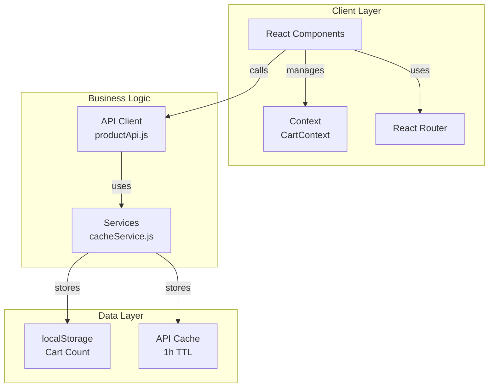
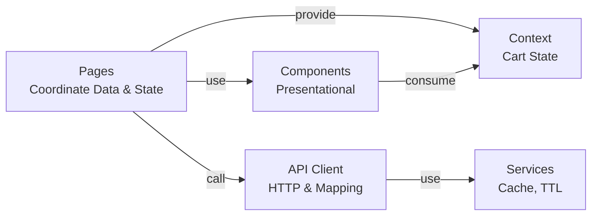
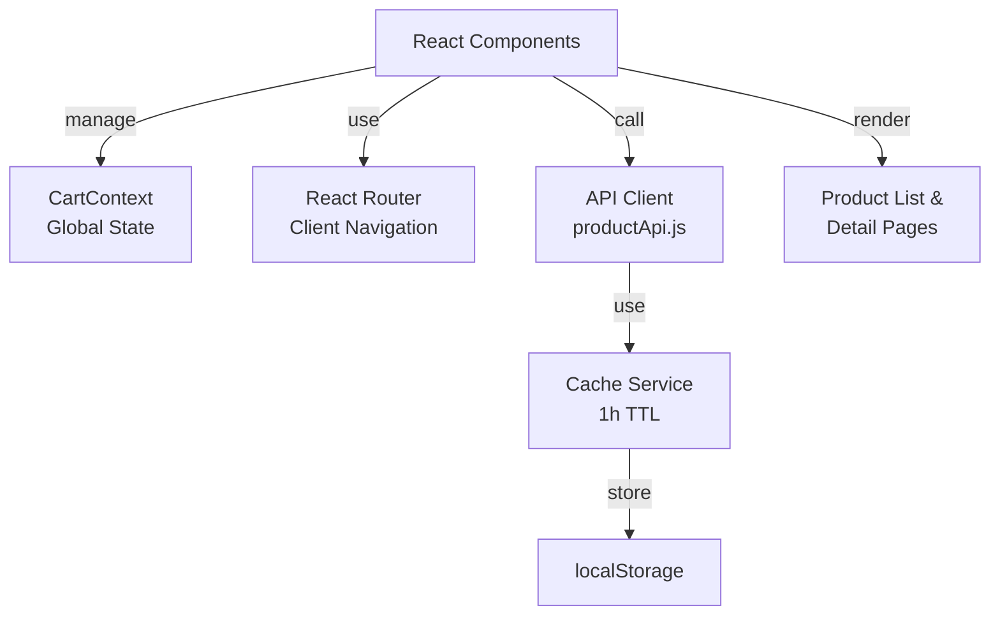
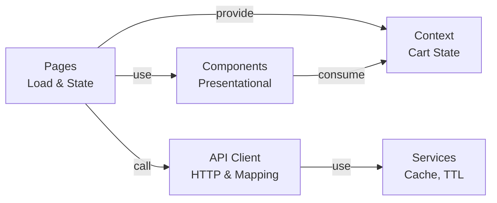

# Mobile Device Store - Frontend SPA

React single-page application for browsing and purchasing mobile devices. Built with Vite, React Router, and Vitest.

## Features

- **Product Listing** - Browse with real-time search by brand and model
- **Product Details** - View comprehensive specifications
- **Shopping Cart** - Add products with color and storage options
- **Client-side Routing** - Navigate without page reloads
- **Response Caching** - 1-hour TTL to reduce network calls
- **Cart Persistence** - Shopping cart count in localStorage

## Technology Stack

- **React 19** - UI framework with functional components and hooks
- **Vite 8** - Build tool and dev server (Node 24+)
- **React Router 7** - Client-side routing
- **Tailwind CSS 4** - Utility-first styling with responsive design
- **Vitest 4 + React Testing Library** - Unit testing (24 tests)
- **Playwright** - E2E testing (12 tests)
- **ESLint** - Code quality checks

## Architecture



### Project Structure

```
src/
├── api/
│   └── productApi.js              # HTTP client with response mapping
├── components/
│   ├── Header.jsx                 # Navigation + cart counter
│   ├── ProductCard.jsx            # Product list item
│   ├── ProductDescription.jsx     # Product specs display
│   └── ProductActions.jsx         # Storage/color + add to cart
├── context/
│   └── CartContext.jsx            # Global cart state
├── pages/
│   ├── ProductListPage.jsx        # Main page with search
│   └── ProductDetailPage.jsx      # Single product page
├── services/
│   └── cacheService.js            # localStorage wrapper with TTL
├── __fixtures__/
│   └── products.js                # Reusable test data
└── setupTest.js                   # Global test configuration

Tests are co-located: ProductCard.test.jsx, ProductListPage.test.jsx, etc.
```

### Data Flow



## Quick Start

```bash
# Install and run
npm install
npm start    # or npm run dev (http://localhost:5173)

# Testing
npm run test -- --run       # Unit tests
npm run e2e                 # E2E tests
npm run lint                # ESLint

# Production
npm run build   # Creates dist/
```

**Node.js 24+** required

## Testing

- **24 unit tests** - API client, components, pages, services, caching
- **12 E2E tests** - Product listing, search, cart, navigation (Chrome + Firefox)
- **Linting** - ESLint for code quality
- **Build** - Vite bundle verification (~78KB gzipped)

All tests pass. CI/CD pipeline enforces checks on every push.

## Design & UX

- **Responsive Layout** - Mobile-first design with Tailwind utility classes
  - PLP: 2 columns (mobile) → 3 (tablet) → 4 (desktop)
  - PDP: Single column (mobile) → two columns (md+) for image and specs
  - Maximum container width on larger screens for readability
- **Visual Hierarchy** - Clear contrast ratios and typography scale
  - Slate palette with accent red for CTAs
  - Loading states with animated spinner
  - Hover states with smooth transitions (scale, color)
- **Accessibility** - Semantic HTML, focus states, keyboard navigation

## API Integration

Backend: `https://itx-frontend-test.onrender.com/api`

- `GET /api/product` - All products
- `GET /api/product/:id` - Single product
- `POST /api/cart` - Add to cart

Responses cached for 1 hour to reduce network calls.

## Architecture



**Data Flow:**



**Layered structure:**
- **Pages** - Coordinate data loading and routing
- **Components** - Presentational UI with props
- **API Client** - HTTP calls with response mapping
- **Services** - Technical concerns (caching, TTL)
- **Context** - Global cart state

**Component best practices:**
- Functional components only
- Hooks for state/lifecycle
- Small, focused components
- Fetch via custom services

## Future Improvements

### Traceability & Analytics
- **Event Tracking Service** - Track user actions (searches, add-to-cart, navigation)
- **Performance Monitoring** - Measure API call duration, identify slow endpoints
- **Error Tracking** - Centralized error logging with context (component, action, payload)
- **Developer Feedback** - Console debug panel for development, telemetry in production

**Example:**
```javascript
// analyticsService.track('search_executed', { query, results })
// analyticsService.measureAsync('api_call', fetchFn, metadata)
// analyticsService.trackError('add_to_cart', error, context)
```

### Custom Hooks
- **useProducts()** - Encapsulate product list loading, error handling, caching
- **useProduct(id)** - Single product data with auto-fetch and cache
- **useCart()** - Enhanced cart hook with add/remove operations
- **useAsync(fn)** - Generic hook for loading states and error handling
- **useLocalStorage(key)** - Wrapper for localStorage operations

**Benefits:**
- Reduce component complexity
- Extract async logic from components
- Share stateful logic across components
- Easier testing of custom logic

---

**Updated**: July 7, 2026 | **Node**: 24+ | **Package Manager**: npm

- [React](https://react.dev/)
- [React Router](https://reactrouter.com/)
- [Vite](https://vitejs.dev/)
- [Vitest](https://vitest.dev/)
- [Playwright](https://playwright.dev/)
- [ESLint](https://eslint.org/)

## Project Details

- **Type**: Technical Assessment
- **Status**: ✅ Complete
- **Test Coverage**: 100%
- **Repository**: [github.com/Lolo179/challenge-luis](https://github.com/Lolo179/challenge-luis)

---

**Updated**: July 7, 2026 | **Node**: 24+ | **Package Manager**: npm

- ES6+ JavaScript
- React 19
- localStorage API
- Fetch API

## Deployment

Build the app for production:

```bash
npm run build
```

This creates an optimized build in the `dist/` folder that can be deployed to any static hosting service (Netlify, Vercel, GitHub Pages, etc.).

## Development Notes

- No TypeScript - pure JavaScript ES6
- No state management libraries (Redux, Zustand) - React Context is sufficient
- No CSS frameworks - plain CSS with Grid and Flexbox
- Functional components only - no class components
- Tests co-located with source code for easy maintenance

## Performance Features

- **Code splitting** via Vite
- **1-hour response caching** with localStorage
- **Responsive images** with lazy loading
- **Optimized CSS** with media queries
- **Fast refresh** during development

---

Developed as a technical assessment for a mobile device store frontend SPA.
- JavaScript ES6 (sin TypeScript)

## Instalación

```bash
npm install
```

## Scripts

- `npm run dev` — servidor de desarrollo
- `npm run build` — compilar para producción
- `npm run test` — ejecutar tests
- `npm run lint` — verificar código

## Estructura

```
src/
  api/          → Peticiones HTTP con caché
  components/   → Componentes presentacionales
  context/      → Cart Context
  pages/        → Páginas (coordinan datos y routing)
  services/     → Lógica técnica (cacheService)
```

## API

Base URL: `https://itx-frontend-test.onrender.com/`

- `GET /api/product` — Listado de productos
- `GET /api/product/:id` — Detalle de producto
- `POST /api/cart` — Añadir al carrito
